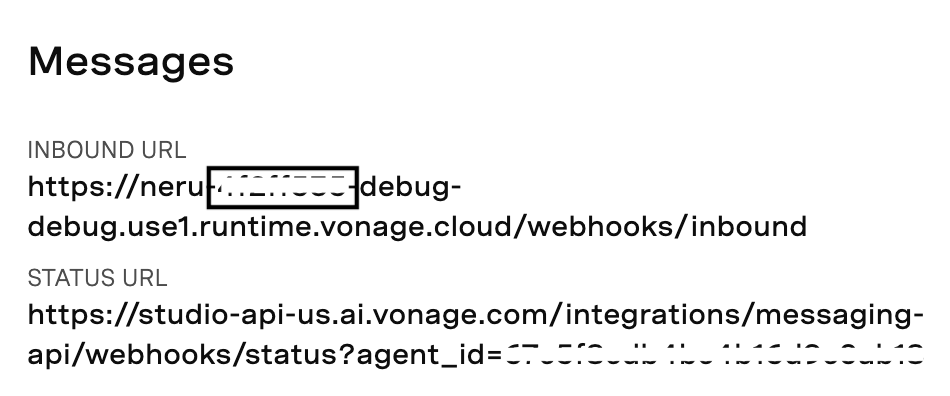

# Vonage AI Studio Vonage Cloud Runtime Queue WhatsApp Messages API

We overcome 3 issues with this Proxy.

1. The problem is that at this time Vonage AI Studio has a limit of 1 POST request per second. To remedy this, we integrate Vonage Cloud Runtime (VCR) to queue the outbound WhatsApp Messages and continue to send them out at the same rate that satisfies AI Studio.

   For example, if you were to make sequential POST requests to AI Studio `https://studio-api-us.ai.vonage.com/messaging/conversation` at a faster rate than 1 request per second, you would receive the error below. This would not only fail to send your WhatsApp message, but would not offer you a retry mechanism. So by adding VCR into the picture, we now would allow a 3 Times Retry if it fails initially.

```js
{
    "message": ""Too Many Requests" Please reach studio team to increase rate limit at ai.support@vonage.com."
}
```

2. The `client_ref` property in the payload is overwritten with "AI Studio". To overcome this, we use VCR State Provider to store/retrieve the value.

```js
client_ref: 'AI Studio',
```

3. Once we configured the Studio AI Vonage Application Inbound URL to point to this webhooks server route `/webhooks/inbound` we are able to capture user's repsonse to WhatsApp messages that were sent out via Studio AI WhatsApp Outbound

## Initial Setup

1. [Clone this Repository](https://github.com/nexmo-se/aistudio-vcr-messages-queue.git)
2. Install the NPM package Dependencies, by running `npm install`.
3. [Install Vonage Cloud Runtime CLI](https://developer.vonage.com/en/vonage-cloud-runtime/getting-started/working-locally?source=vonage-cloud-runtime)
4. Configure your CLI `vcr configure`.
5. Upgrade your CLI `vcr upgrade`
6. Run `vcr app create --name "aistudio-vcr-queue-demo"` and copy application id (only if you don't have an app yet)
7. Run `cp vcr.yml.example vcr.yml` and paste Vonage Application Id, Project Name, Instance Name, and Region into `vcr.yml`.
8. Confirm you have linked your Vonage Number to the AI Studio VCR Application. You can do this in either the Vonage Dashboard or AI Studio.

> The endpoint depends on the region you selected for your agent
> For EU agents --> https://studio-api-eu.ai.vonage.com/messaging/conversation
> For US agents --> https://studio-api-us.ai.vonage.com/messaging/conversation

> This demo uses [AI Studio Triggering an outbound WhatsApp virtual agent](https://studio.docs.ai.vonage.com/whatsapp/get-started/triggering-an-outbound-whatsapp-virtual-agent).

> Gather AI Studio Key and Agent ID and apply
> You can find the X-Vgai-Key on the top right of your canvas. Click on the "user" icon, and then "Generate API Key".

To apply:

```js
vcr secret add --name AI_X_VGAI_KEY --value "YOUR_AI_X_VGAI_KEY"
vcr secret add --name AI_AGENT_ID --value "YOUR_AI_AGENT_ID"
export AI_X_VGAI_KEY="YOUR_AI_X_VGAI_KEY"
export AI_AGENT_ID="YOUR_AI_AGENT_ID"
```

### Configure VCR file

We need to set the environment variables within the `vcr.yml` file. Please copy the `vcr.yml.example` file and name it as `vcr.yml`, then update it.

```js
  environment:
    - name: defaultMaxInflight
      value: 30
    - name: defaultMsgPerSecond
      value: 1
    - name: WEBHOOK_STATUS_URL
      value: "VCR_URL/status"
    - name: FORWARD_URL
      value: "VCR_URL/forward-url"
    - name: AI_AGENT_REGION
      value: https://studio-api-us.ai.vonage.com/messaging/conversation
    - name: AI_X_VGAI_KEY
      secret: AI_X_VGAI_KEY
    - name: AI_AGENT_ID
      secret: AI_AGENT_ID
```

## VCR Debug vs VCR Deploy

`vcr debug` vs `vcr deploy` both produce different Server URLs. Debug allows us to view logs in the terminal until the terminal is killed, but Deploy is a permanent live URL.

To deploy the application permanently for use run `vcr deploy`. Copy URL and use it in your POST request.

- You will have to go to VCR at Vonage Dashboard and view logs for the Server Instance.

Otherwise, to just test it, run in Debug mode run `vcr debug`. Copy URL and use it in both your POST requests to (1) Add a WhatsApp Message to VCR Queue and (2) edit the `status_url: VCR_URL/webhooks/status` in the request body.

Set Studio AI Vonage Application Inbound URL to point to this VCR_URL/webhooks/inbound route



## Running the Demo

For Demo purposes and testing we will `vcr debug -y`

Testing the App locally run `vcr debug -y`

For testing purposes, you can ensure the correct `client_ref` is applied, by setting the `WEBHOOK_STATUS_URL` value with `VCR_DEBUG_URL/status` within the `vcr.yml` file.

The POST `VCR_URL/status` route is useful for validating that the `client_ref` is correctly retrieved and sent to the `/VCR_URL/status` route. You can replace this with your own URL.

### Create the Queue (queue_name) POST Request

POST `VCR_URL/queues/create`

AUTH: For all requests, set Basic Auth. Username is apiKey and Password is its secret.

Body:

```js
{
    "name": "testqueue01",
    "maxInflight": 30,
    "msgPerSecond": 1
}
```

Response:

```js
{
    "success": true,
    "name": "testqueue01",
    "maxInflight": 30,
    "msgPerSecond": 1
}
```

### Just FYI, you can Delete the queue (queue_name) if you want to

DELETE `VCR_URL/queues/:queue_name`

Usage: delete a queue and all its contents immediately.

AUTH: For all requests, set Basic Auth. Username is apiKey and Password is its secret.

Params: queue_name = YOUR_QUEUE_NAME_YOU_CREATED. For example, name = testqueue01.

Payload: none

Response:

```js
{
    "success": true
}
```

### Add a WhatsApp Message to VCR Queue

POST `VCR_URL/queues/additem/:queue_name`

AUTH: For all requests, set Basic Auth. Username is apiKey and Password is its secret.

Params: queue_name = YOUR_QUEUE_NAME_YOU_CREATED. For example, name = testqueue01.

Example WhatsApp Body

```js
{
    "components": [
        {
            "type": "header",
            "parameters": [
                {
                    "type": "text",
                    "text": "PARAM1_VALUE"
                }
            ]
        },
        {
            "type": "body",
            "parameters": [
                {
                    "type": "text",
                    "text": "PARAM2_VALUE"
                }
            ]
        }
    ],
    "namespace": "NAMESPACE_ID",
    "template": "TEMPLATE_NAME",
    "locale": "en",
    "to": "TO_NUMBER",
    "agent_id": "AGENT_ID",
    "channel": "whatsapp",
    "client_ref": "string",
    "status_url": "VCR_URL/webhooks/status"
}
```

Notice the `VCR_URL/webhooks/status` is set in the body payload.

In the terminal, we'll see logs show

```js
/webhooks/status: {
  to: '12013779099',
  from: '15754940000',
  channel: 'whatsapp',
  message_uuid: 'abc-1356-4540-9f3b-ddb1564dc008',
  timestamp: '2025-03-05T22:51:41Z',
  usage: { price: '0.04', currency: 'EUR' },
  status: 'delivered',
  client_ref: 'AI Studio',
  whatsapp: {
    conversation: { id: 'abc', origin: [Object] }
  },
  internal_message_uuid: 'abc-b51a-4e96-a82b-275dfec7877e'
}
/webhooks/status: {
  to: '12013779099',
  from: '15754940000',
  channel: 'whatsapp',
  message_uuid: 'abc-1356-4540-9f3b-ddb1564dc008',
  timestamp: '2025-03-05T22:51:41Z',
  status: 'read',
  client_ref: 'AI Studio',
  internal_message_uuid: 'abc-b51a-4e96-a82b-275dfec7877e'
}
Sending payload to WEBHOOK_STATUS_URL: {
  to: '12013779099',
  from: '15754940000',
  channel: 'whatsapp',
  message_uuid: 'abc-1356-4540-9f3b-ddb1564dc008',
  timestamp: '2025-03-05T22:51:41Z',
  usage: { price: '0.04', currency: 'EUR' },
  status: 'delivered',
  client_ref: 'X_Y_Z',
  whatsapp: {
    conversation: { id: 'abc', origin: [Object] }
  },
  internal_message_uuid: 'abc-b51a-4e96-a82b-275dfec7877e'
}
Sending payload to WEBHOOK_STATUS_URL: {
  to: '12013779099',
  from: '15754940000',
  channel: 'whatsapp',
  message_uuid: 'abc-1356-4540-9f3b-ddb1564dc008',
  timestamp: '2025-03-05T22:51:41Z',
  status: 'read',
  client_ref: 'X_Y_Z',
  i
```

The `VCR_URL/webhooks/status` route is triggered which modifies the `client_ref`.

```js
/status: {
  to: '12013779099',
  from: '15754940000',
  channel: 'whatsapp',
  message_uuid: 'abc-1356-4540-9f3b-ddb1564dc008',
  timestamp: '2025-03-05T22:51:41Z',
  usage: { price: '0.04', currency: 'EUR' },
  status: 'delivered',
  client_ref: 'X_Y_Z',
  whatsapp: {
    conversation: { id: 'abc', origin: [Object] }
  },
  internal_message_uuid: 'abc-b51a-4e96-a82b-275dfec7877e'
}

/status: {
  to: '12013779099',
  from: '15754940000',
  channel: 'whatsapp',
  message_uuid: 'abc-1356-4540-9f3b-ddb1564dc008',
  timestamp: '2025-03-05T22:51:41Z',
  status: 'read',
  client_ref: 'X_Y_Z',
  internal_message_uuid: 'abx-b51a-4e96-a82b-275dfec7877e'
}
```

Each item in queue is execute route `VCR_URL/queues/:name`, which makes a Studio AI WhatsApp Outbound

When the WhatsApp user clicks a button or sends a reply, the route `/webhooks/inbound` forwards the `req.body` to the `FORWARD_URL` defined. For demo purposes we have it set to route `/forward_url` to log execution.

```js
/webhooks/inbound: {
  to: '12013779099',
  from: '15754940000',
  channel: 'whatsapp',
  message_uuid: 'abc-xyz-4542-8ece-0b591ac2d178',
  timestamp: '2025-03-05T22:51:49Z',
  message_type: 'button',
  button: { text: 'Stop promotions', payload: 'Stop promotions' },
  context_status: 'available',
  context: {
    message_from: '12013779099',
    message_uuid: 'abc-xyz-b37dbd2f-1356-4540-9f3b-ddb1564dc008'
  },
  profile: { name: 'Kitt' }
}
```

We are able to capture the button text and payload.

```js
/forward-url: {
  to: '12013779099',
  from: '15754940000',
  channel: 'whatsapp',
  message_uuid: 'abc-xyz-4542-8ece-0b591ac2d178',
  timestamp: '2025-03-05T22:51:49Z',
  message_type: 'button',
  button: { text: 'Stop promotions', payload: 'Stop promotions' },
  context_status: 'available',
  context: {
    message_from: '12013779099',
    message_uuid: 'abc-xyz-b37dbd2f-1356-4540-9f3b-ddb1564dc008'
  },
  profile: { name: 'Kitt' }
}
```

## Credits

Thanks to Toni Kusham for sharing VCR Queue sample code [See Here](https://github.com/klapperkopp/vcr-simple-queue-demo/tree/add-optional-filters-and-checks)
